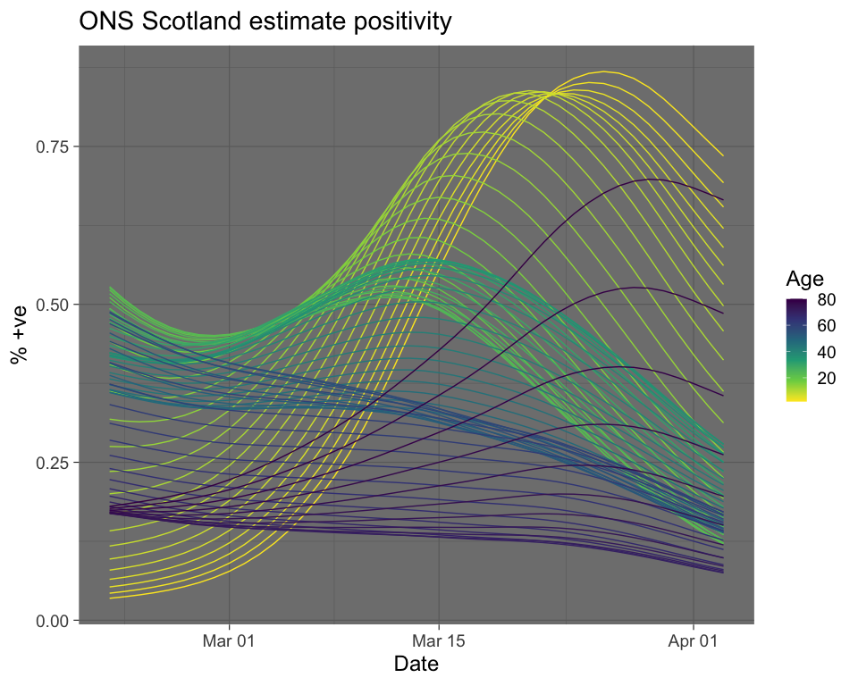

ONS 2021
================
IH
11/04/2021

``` r
library(tidyverse)
library(tidyxl)
library(unpivotr)
library(lubridate)
library(janitor)
```

``` r
ons <- xlsx_cells("covid19infectionsurveydatasets20210409.xlsx",
                  sheet = "5e ") %>% 
  
  # need to automate this next filter...
  
  filter(row >= 5 & row <= 49) %>% 
  
  # strip off headers one by one
  
  behead(direction = "N", name = "age") %>%
  behead(direction = "N", name = "blah") %>%
  behead(direction = "N", name = "ci") %>%
  behead(direction = "W", "date") %>% 
  
  # just the stuff we want
  
  select(date = date.header, age, ci, value = numeric) %>% 
  
  fill(age) %>%
  
  # some coding
  
  mutate(ci = fct_explicit_na(ci, "prop_pos")) %>%
  mutate(age = parse_number(age)) %>% 
  mutate(date = ymd(date)) %>% 
  
  # format for plotting...
  
  pivot_wider(names_from = ci, values_from = value, values_fn = na.omit) %>% 
  clean_names()
```

``` r
ons %>% 
  ggplot() +
  aes(x = date,
      y = prop_pos,
      colour = age, group = age) +
  geom_line() +
  scale_color_viridis_c(direction = -1) +
  theme_dark(base_size = 18) +
  labs(title = "ONS Scotland estimate positivity",
       x = "Date",
       y = "% +ve",
       colour = "Age")
```

<!-- -->
